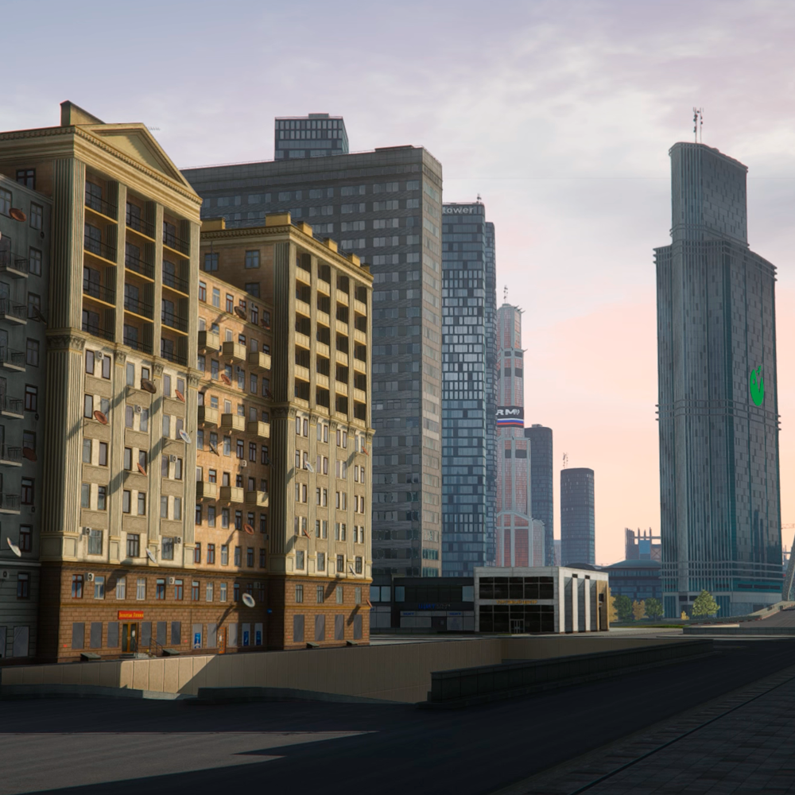
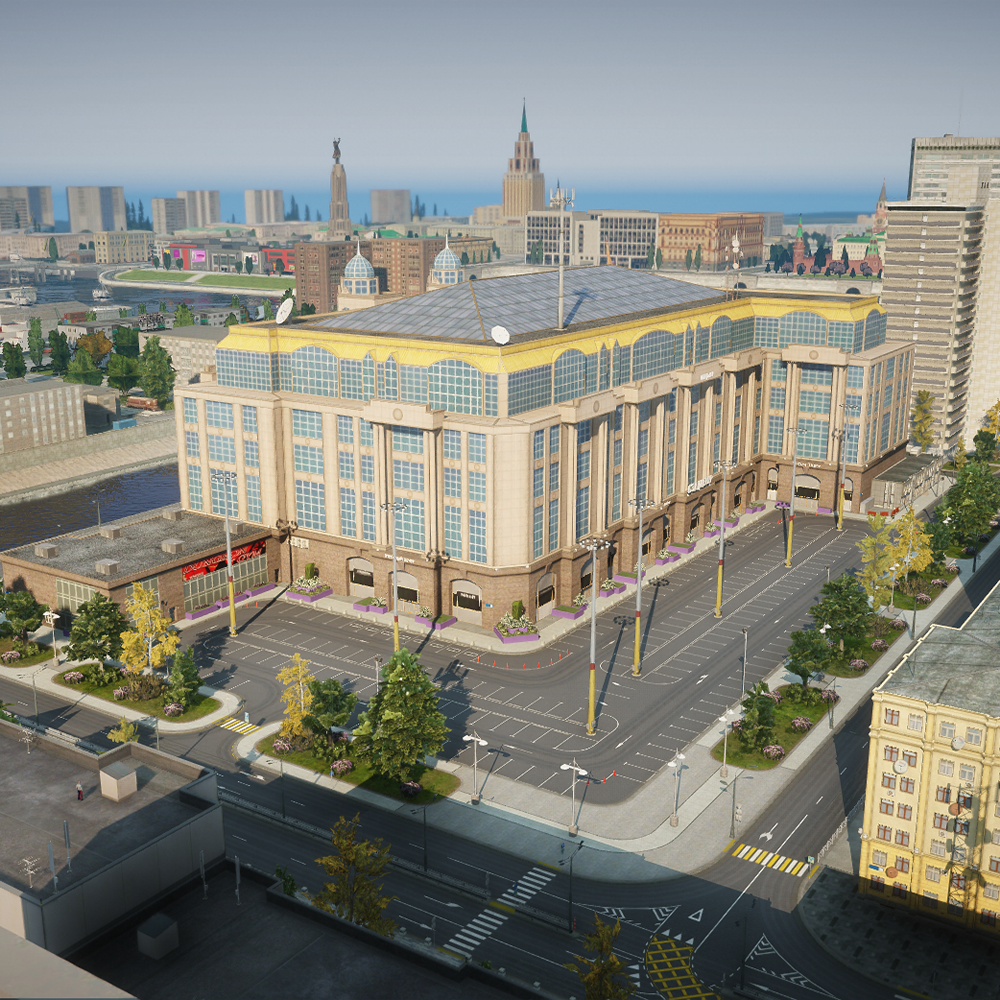
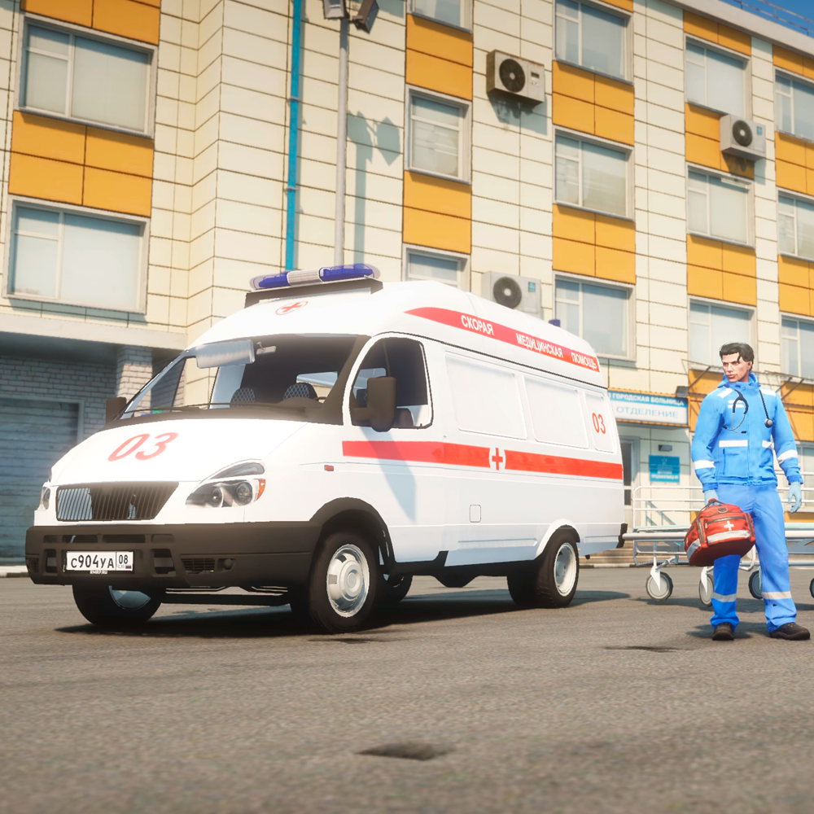

# Россия онлайн в ГТА 5 РП | Москва в GTA 5 RP

ГТА 5 РП у большинства ассоциируется с Лос-Сантосом и привычными американскими улицами. На RMRP это чувствуется особенно ярко: играть онлайн в Москве куда интереснее, чем в выдуманном американском городе. Ты заходишь и сразу узнаёшь места, здания, дворы. Именно так и работает Россия онлайн в ГТА 5 РП - тут чувствуется родная атмосфера. Легче влиться в процесс, потому что всё знакомо до мелочей. За счёт этого проще начинать и куда интереснее отыгрывать свою роль - не в абстрактном городе, а в Москве, которую ты и так знаешь.

## Город в ГТА 5 РП, который растет вместе с игроками

Карта Москвы постоянно развивается: добавляются новые районы, расширяются улицы, появляются знаковые объекты. Здесь легко узнать реальные места, и от этого атмосфера ощущается ещё роднее. Это не набор декораций, а живая Москва, где Россия онлайн чувствуется буквально на каждом шагу.

## Россия в онлайне: атмосфера, где хочется задержаться

На RMRP нет токсиков, которые отпугивают новичков. Даже если такой попадётся — это скорее редкость, чем правило. В целом здесь доброжелательная среда, в которой новичок не тонет в сарказме, а быстро находит темп. Игроки помогают друг другу, втягивают в движ и дают шанс попробовать себя в разных ролях.

Ещё один плюс - огромное кол-во уникальных фракций. В ГТА 5 РП на RMRP доступны ДПС, Росгвардия, ЧОП, СМИ со своим радио и настоящими ведущими. Кому-то ближе строгая служба, кому-то - микрофон на радиоэфире, кому-то - работа в тени. Благодаря этому Россия онлайн в ГТА 5 РП ощущается по-настоящему живой и динамичной. За счёт такого выбора играть онлайн становится увлекательнее — всегда есть чем заняться и куда податься

Транспорт здесь — отдельный кайф. На сервере сотни машин, и каждая ощущается по-своему. Это полноценная часть геймплея: хочешь рабочую тачку, хочешь стильное авто для понтов — выбор всегда есть. Управление у каждой модели отличается, поэтому даже обычная поездка по городу превращается в событие. Машина становится продолжением персонажа и задаёт его ритм в Москве.

Чтобы зайти на сервер, не нужно ничего лишнего — только сама GTA 5 на ПК. Лаунчер RMRP полностью бесплатный: скачиваешь, устанавливаешь и сразу создаёшь персонажа. На старте тебе выдаётся машина, чтобы не бегать пешком и сразу влиться в ритм города. Дальше всё решаешь сам, работаешь, ищешь движ или просто катаешься по Москве. Это и есть настоящая Россия онлайн в ГТА 5 РП.

Скачиваешь лаунчер, заходишь и начинаешь играть онлайн в Москве — с машиной на старте и без лишних барьеров.

